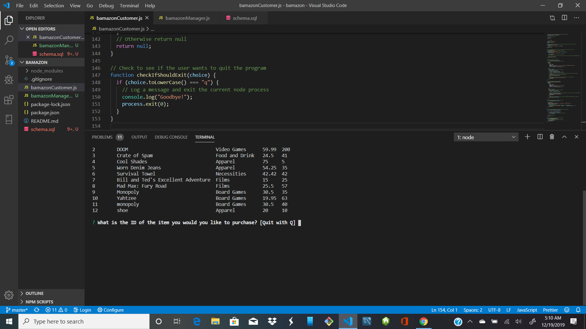
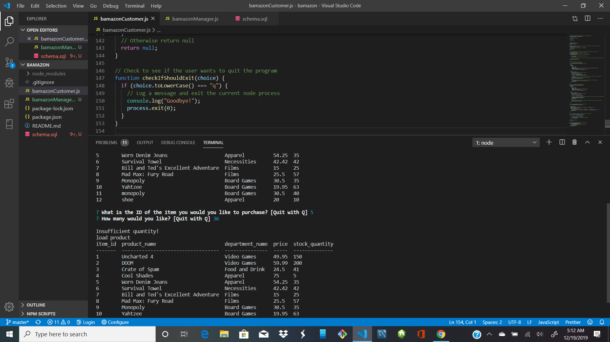
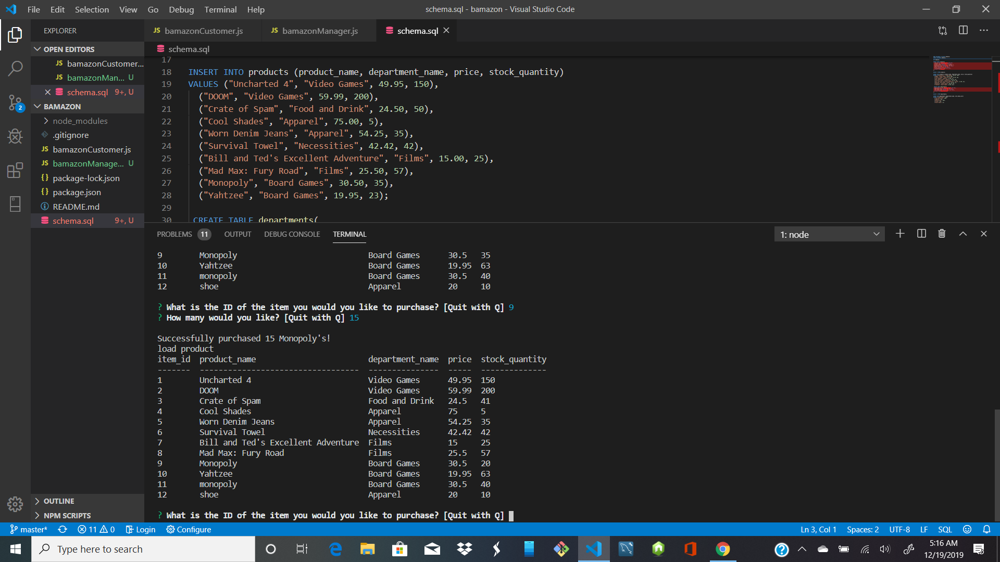
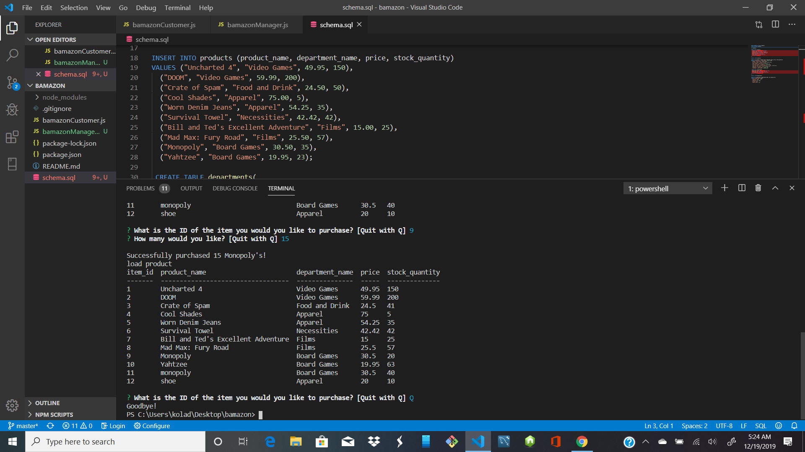

# Bamazon
Bamazon is an App that offers shoppers the opportunity to shop for different kind of products wherever they go, plus product price and its availability. Also the app has organised and unique features that made the app shopper's friendly and it includes:
1. Ordering of Items available for shopping,
2. Product Name,
3. Department name,
4. Price &
5. Stock Quantity.

Bamazon is made to function like Amazon Shopping App and  It has 3 distinct category namely;
1. BamazonCustomer.js
2. BamazonManager.js
3. BamazonSupervisor.js

# BamazonCustomer.js
 This app creates an interface for a customer to purchases anything from the store, while the price of the product is multiplied by the quantity purchased and the result is added to the product's product_sales column. Running this app will first display all of the items available for sale and it includes ids, names, and prices of the products for sale. It also updates the inventory and display insufficient quantity when store does not have enough products to meet the Customer's need.. below are the screen shots showing the Demo and the app functionality;

# BamazonCustomer.js